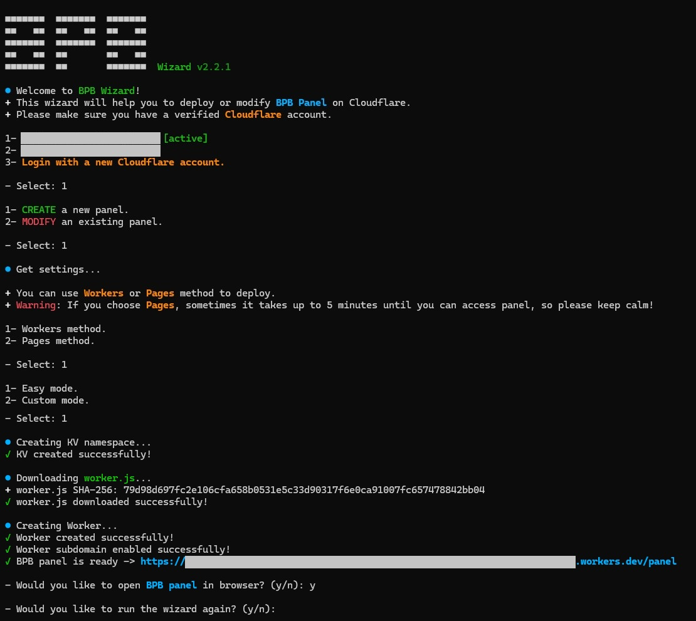

<h1 align="center">💦 BPB Wizard</h1>

This project aims to facilitate the deployment and management process of [BPB Panel](https://github.com/bia-pain-bache/BPB-Worker-Panel) and prevent user mistakes during deployments.

<p align="center">
  
</p>
<br>

## 💡 How to use

### 1. Cloudflare account

To use this method, all you need is a Cloudflare account. You can [sign up here](https://dash.cloudflare.com/sign-up/), and don’t forget to check your email afterward to verify your account.

### 2. Install or modify BPB Panel

> [!WARNING]
> If you're connected to a VPN, disconnect it.

#### Android (Termux) - Linux - macOS

Android users who have Termux installed on their device, Linux and macOS users can use this bash:

```bash
bash <(curl -fsSL https://raw.githubusercontent.com/bia-pain-bache/BPB-Wizard/main/install.sh)
```

> [!IMPORTANT]  
> Be sure to download and install Termux only from its [official source](https://github.com/termux/termux-app/releases/latest). Installing via Google Play might cause issues.

#### Windows

Based on your operating system, [download the ZIP file](https://github.com/bia-pain-bache/BPB-Wizard/releases/latest), unzip it, and run the program.

> [!IMPORTANT]  
> This program downloads `worker.js` from github to deploy to Cloudflare and is not signed by a certificate. This makes Anti Viruses detect it as some kind of Trojan/Downloader threat. You have to disable your Anti Virus before running the program.

## 🌟 Features

1. **Multi login**: You can manage several Cloudflare accounts without logging in (Only first time on a device).
2. **All in one**: Supports creating, listing, deleting and updating BPB panels.
3. **Methods**: Both Pages and Workers deployments are supported.
4. **Cross platform**: Works on all major operating systems i.e. Windows, Android (Termux), macOS and Linux.

## 💡 Updating or deleting Panel

Just run wizard and select option 2 (Modify). It shows you a list of project names in your account — you can choose any to update to the latest stable version or delete.
